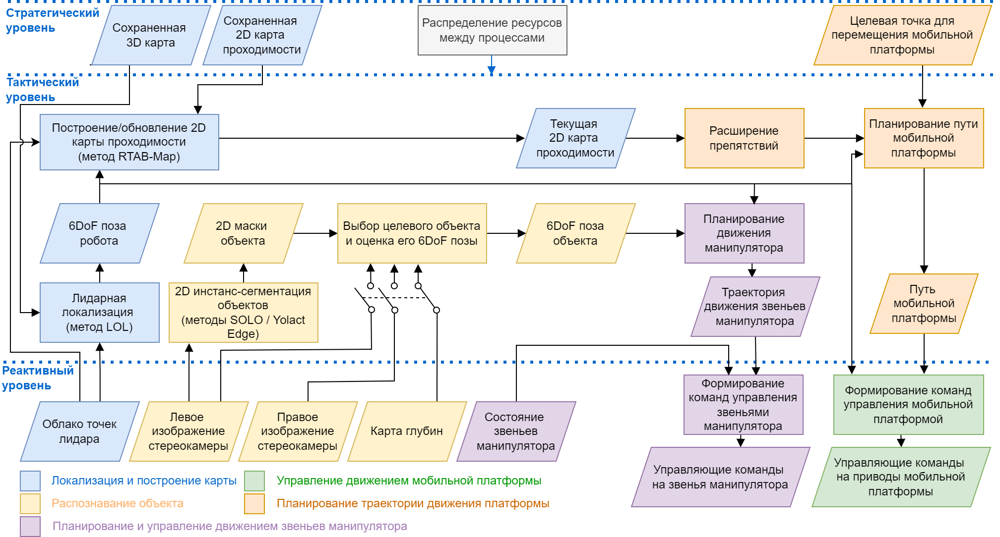
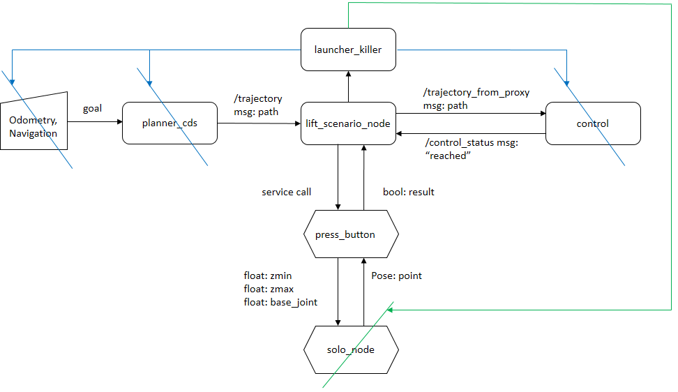

# STRL Robotics - Открытый фреймворк для мобильных роботов



## Модельная задача: использование лифта мобильным роботом с манипулятором

В рамках сценария робот подъезжал к панели лифта, вызывал лифт, заезжал в него и выбирал нужный этаж. 

[](https://www.youtube.com/watch?v=u5fdLFPKltY)

Схема координации ROS-узлов при выполнении сценария приведена на схеме ниже. Для наглядности процессов координации узлов эта схема организована несколько иначе, чем схема общей архитектуры системы и на ней опущены модули, отвечающие за реактивный уровень архитектуры (кроме модуля управления платформой). Стратегический узел-координатор (lift_scenario_node), ответственный за выполнение сценария, определяет, решение каких подзадач требуется при выполнении сценария. Эта информация передается на узел, ответственный за распределение ресурсов между процессами (launcher_killer), который предоставляет вычислительные ресурсы либо модулям локализации и построения карты  (Odometry, Navigation) и планирования движения (planner_cds) колесной платформы, либо модулю распознавания объектов (solo_node). При заезде в лифт модуль управления платформой (сontrol) отрабатывает предпрописанную траекторию, не используя данные навигации. Модуль планирования и управления манипулятором (press_button) не требует доступа к ресурсам, поскольку выполняется на выделенном аппаратном обеспечении манипулятора.




# Документация

[Структура фреймворка с описанием ROS-узлов в pdf](https://yadi.sk/i/YCP-PfHOuK9u6w)

**0. Системы координат робота** 
---
([Владислав Головин](https://github.com/nivolog))<br/>

В [данном](https://docs.google.com/document/d/1kGfOnIeC5bWjCJzUTDcP0kC__uoBlPgtL3U_gv5E1-A/edit?usp=sharing) документе подробно описаны различные системы координат робота и методы перехода между ними.


**1. Система координат карты проходимости (occupancy grid), строящейся методом RTabMap** 
---
([Андрей Криштопик](https://github.com/andrey1908))<br/>

Occupancy grid в rtabmap представлена стандартными сообщениями ros. Подробнее про систему координат occupancy grid можно почитать в [google doc’е](https://docs.google.com/document/d/1c-a6FynTeuAUqqo1ZnpUuR1_c4Y5wkpEJcfqtCDtESY/edit?usp=sharing) в разделе “Работа с Occupancy Grid”. Также в папке occupancy\_grid\_mapping есть папка rtabmap\_example, в которой находится скрипт occupancy\_grid\_demo.py, реализующий работу с occupancy grid. Про этот скрипт написано в том же google doc'е в разделе "Реализация работы с occupancy grid".


**2. Переход из системы координат карты в систему координат одометрии (в систему координат baselink робота)** 
---
([Андрей Криштопик](https://github.com/andrey1908) + [Линар Абдразаков](https://github.com/LinarAbdrazakov) + [Владислав Головин](https://github.com/nivolog))<br/>

Чтобы получить трансформацию между различными системами координат, можно использовать функцию [lookupTransform](http://wiki.ros.org/tf2/Tutorials/Writing%20a%20tf2%20listener%20%28C%2B%2B%29) для C++ или [lookup_transform](http://wiki.ros.org/tf2/Tutorials/Writing%20a%20tf2%20listener%20%28Python%29) для Python. Пример получения координат робота в мировой системе координат можно посмотреть в скрипте occupancy\_grid\_demo.py в папке occupancy\_grid\_mapping/rtabmap\_example/scripts в функции get\_robot\_world\_pose. 


**3. Перевод в систему координат base_link робота для одометрии.** 
---
([Линар Абдразаков](https://github.com/LinarAbdrazakov)) <br/>

Есть три основных систем координат:
- map - система координат карты;
- odom - система координат, относительно которой считается одометрия (совпадает с системой координат base_link при запуске одометрии);
- base_link - система координат робота.
<br/>
В сообщениях одометрии хранится трансформация между двумя системами координат (поля frame_id и child_frame_id). Каждый метод одометрии имеет свои системы координат frame_id и child_frame_id, информация о которых не публикуется в топик /tf. Поэтому их нужно привести к общим системам координат так, чтобы frame_id = odom и child_frame_id = base_link. 
Перевод одометрии в систему координат base_link происходит с использованием пакета [tf_transformer](odometry/odometry_fusion/tf_transformer) , который автоматически запускается вместе с robot_localization.


**4. О запуске RTabMap и построения ocupancy grid в multisession режиме** 
---
([Андрей Криштопик](https://github.com/andrey1908))<br/>

В папке occupancy\_grid\_mapping есть папка rtabmap\_example, в которой находится launch файл для запуска rtabmap и вспомогательные скрипты. Про запуск rtabmap с помощью launch файла из rtabmap\_example написано в [google doc'е](https://docs.google.com/document/d/1CMNFhYlmfJb-XJJDk92J0y-mMTqQdyz_rtd2w-TJOmI/edit?usp=sharing). В этом же google doc'е описана работа в режиме multi-session.

[](https://www.youtube.com/watch?v=S6nIUXKn29M)

**5. О запуске комплексирования данных одометрии** 
---
([Линар Абдразаков](https://github.com/LinarAbdrazakov)) <br/>

Запуск методов одометрии и их комплексирования описан [здесь.](odometry) <br/>
Комплексирование происходит трех видов одометрии: [визуальная](odometry/visual_odometry), [лидарная](odometry/lidar_odometry) и колесная. <br/>
Перед комплексированием каждая одометрия приводится к системе координат base_link (frame_id=odom, child_frame_id=base_link).
Изменить конфигурацию комплексирования можно в [данном файле](odometry/odometry_fusion/robot_localization/params/husky_mipt_odometry_fusion.yaml). Описание параметров конфигурации можно найти [здесь](http://docs.ros.org/en/melodic/api/robot_localization/html/state_estimation_nodes.html). 


**6. О планировании движения к цели, заданной на карте** 
---
([Владислав Головин](https://github.com/nivolog))<br/>

Планирование движения осуществляется с помощью узлов, находящихся в папке [planning](planning). Для постановки задачи планировщику необходимо подать на вход карту проходимости типа nav_msgs/OccupancyGrid, целевую точку geometry_msgs/PoseStamped и локализацию робота - трансформацию geometry_msgs/TransformStamped из tf дерева. На выходе узел выдает траекторию типа geometry_msgs/PoseArray и визуализацию этой траектории visualization_msgs/Marker. Подробнее о работе узла планирования написано [здесь](planning/README.md).

**7. О реализации движения по траектории** 
---
([Мухаммад Алхаддад](https://github.com/MuhammadAlhaddad))<br/>

[Модуль управления](control) обеспечивает высокоуровневый контроллер (high-level control) для мобильного робота с дифференциальным приводом. Он содержит два метода управления роботом - отслеживание пути (Path Following) и отслеживание траектории (Trajectory Tracking). Модуль управления реализован в ROS. Пакеты управления принимают одометрие робота и путь планировщика в качестве входных данных и выдает закон управления линейной и угловой скоростями в качестве выходных данных. Подробнее о узле управления написано [здесь](control). 

**8. О программном управлении манипулятором** 
---
([Константин Миронов](https://github.com/mironovconst))<br/>

Инструкция по запуску манипулятора и установке соединения с помощью RTDE и ROS driver: https://drive.google.com/file/d/16oZ_x8Eod7x_Ixsb_DDcYgvkqMCB1I2m/view?usp=sharing Также там описание скриптов set_freedrive и fold_the_robot, которые можно применить, чтобы изменить положение манипулятора вручную (например, если он мешает работе сенсоров), а потом автоматически вернуть манипулятор в исходную позицию. Код, задействующий манипулятор, на Husky лежит в папке Repos/manipulator. 


**9. Об обнаружении 3D-позы манипулируемых объектов (например, кнопок лифта)** 
---
([Сергей Линок](https://github.com/linukc))<br/>

Набор данных для инстанс-сегментации кнопок лифта ElevatorButtons: https://github.com/linukc/elevator_buttons

Сегментация кнопок моделью [SOLOv2](https://github.com/WXinlong/SOLO).
Используется 1 нода solo (распознавание на rgb) и данные с карты глубины.
Команды для запуска на роботе Husky находятся в docs.
Публикуется PoseStamped msg с координатами центра и оринтацией в пространстве.
Ориентация в пространстве получена с помощью 3D координат точек вокруг цели.

**10. Важная информация о состоянии робота** 
---
[Линар Абдразаков](https://github.com/LinarAbdrazakov) <br/>

Основная информация о состоянии робота публикуется в топик /status. 

**Пример вывода топика /status при питании робота от сети**

```
header:                              
  seq: 28287
  stamp:
    secs: 1614184608
    nsecs: 173392658
  frame_id: ''
uptime: 28330379
ros_control_loop_freq: 9.9974492508
mcu_and_user_port_current: 0.82
left_driver_current: 0.0
right_driver_current: 0.0
battery_voltage: 26.88
left_driver_voltage: 0.0
right_driver_voltage: 0.0
left_driver_temp: 0.0
right_driver_temp: 0.0
left_motor_temp: 0.0
right_motor_temp: 0.0
capacity_estimate: 480
charge_estimate: 1.0
timeout: False
lockout: True
e_stop: Trueна рисунке \ref{fig:architecture} 
ros_pause: False
no_battery: True
current_limit: False
```


