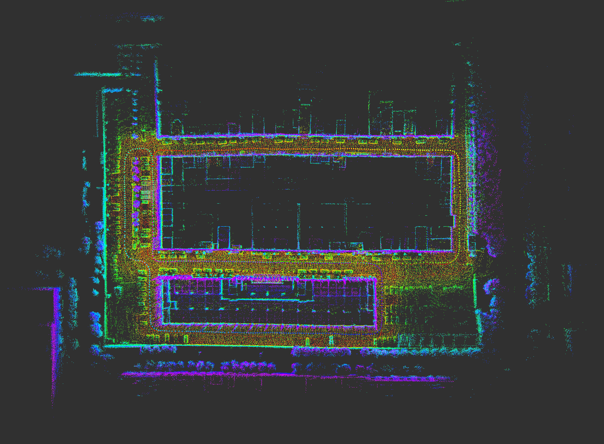
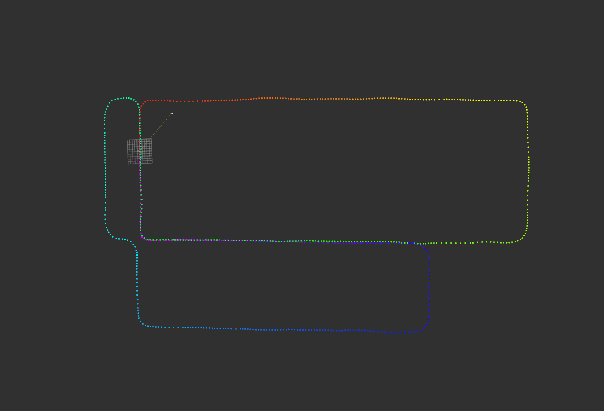

# A-LeGO-LOAM

## Introduction

~~Advanced~~ implementation of LeGO-LOAM[1].


loop-closure enabled map cloud

loop-closure enabled trajectory


## Dependency

- [ROS](http://wiki.ros.org/ROS/Installation) (tested with kinetic)
- [gtsam](https://github.com/borglab/gtsam/releases) (Georgia Tech Smoothing and Mapping library, 4.0.2)
  ```
    # Start by installing all the dependencies.
    # sudo apt-get install cmake
    # sudo apt-get install libboost-all-dev

    # We are now ready to build and install gtsam
    wget -O gtsam-4.0.2.zip https://github.com/borglab/gtsam/archive/4.0.2.zip
    unzip gtsam-4.0.2.zip -d .
    cd gtsam-4.0.2/
    mkdir build && cd build
    cmake -DGTSAM_USE_SYSTEM_EIGEN=ON ..
    sudo make install
  ```
- [Ceres Solver](http://ceres-solver.org/installation.html)
```
    # Start by installing all the dependencies.
    # sudo apt-get install cmake
    # sudo apt-get install libgoogle-glog-dev
    # sudo apt-get install libatlas-base-dev
    # sudo apt-get install libeigen3-dev
    # sudo apt-get install libsuitesparse-dev
    
    # We are now ready to build, test, and install Ceres.
    wget ceres-solver.org/ceres-solver-1.14.0.tar.gz
    tar zxf ceres-solver-1.14.0.tar.gz
    mkdir ceres-bin
    cd ceres-bin
    cmake ../ceres-solver-1.14.0
    make -j3
    make test
    sudo make install
```  

## Compile

You can use the following commands to download and compile the package.

```
mkdir a_lego_loam_ws && cd a_lego_loam_ws mkdir src && cd src
git clone https://github.com/jyakaranda/A-LeGO-LOAM.git
cd ..
catkin_make -DCMAKE_BUILD_TYPE=Release -j1
```
When you compile the code for the first time, you need to add "-j1" behind "catkin_make" for generating some message types. "-j1" is not needed for future compiling.

## Usage

### Input

- Point Cloud(`/lslidar_point_cloud`)

### Output

- (`/laser_cloud_surround`)
- ...

### Run the package

1. Run the launch file:

```shell
roslaunch alego test2.launch
```

2. Play existing bag files [test_0515.bag](https://drive.google.com/file/d/1Y6KR9FUQggcyhvGsnkv7zpYQGvc7dQR_/view?usp=sharing):

```shell
rosbag play test_0515.bag --clock --topics /lslidar_point_cloud
```

3. Save map:
```shell
rosservice call /save_map
```

## ImageProjection

There are too many outliers (nearly 1/3), and there are many points in the original data that are too close to each other (nearly half), I do n’t know if it is a radar problem

## LaserOdometry

robo_0529.bag rough test, 1 step optimization time 7915ms (1.90ms / frame) (10 iterations)


2 step optimization time 8888ms (2.13ms / frame), the effect is better (surf 5 iterations, corner 10 iterations)


~~I do n’t know why, occluded points are more than lego, and it ’s speechless, and if it is marked as occluded, there are too few corner features, and the matching effect is very poor.~~ Speechless, it turns out that because segmentedCloudColInd in cloud_msg is uint, there is a problem with arithmetic operation and then assigned to int, and then col_diff is gg now.

## LaserMapping

Note that map2odom should be updated in time after looping


## TODOs

- [ ] parameterize hard coded parameters.
- [ ] find out nodelet crush problem.
- [ ] adjust motion distortion.

## Referecen

1. [https://github.com/RobustFieldAutonomyLab/LeGO-LOAM](https://github.com/RobustFieldAutonomyLab/LeGO-LOAM)
2. [https://github.com/HKUST-Aerial-Robotics/A-LOAM](https://github.com/HKUST-Aerial-Robotics/A-LOAM)
3. Zhang J, Singh S. LOAM: Lidar Odometry and Mapping in Real-time[C]//Robotics: Science and Systems. 2014, 2: 9.
4. Zhang J, Singh S. Low-drift and real-time lidar odometry and mapping[J]. Autonomous Robots, 2017, 41(2): 401-416.
